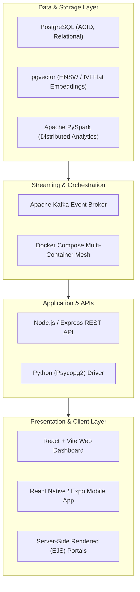

# Database & Information Systems Engineering (CS 349)

[](https://www.postgresql.org/)
[](https://spark.apache.org/)
[]()
[]()
[](https://www.cse.iitb.ac.in/)

> **Academic Affiliation**: Course Projects for **CS 349: Database and Information Systems**, IIT Bombay  
> **Instructors**: **Prof. S. Sudarshan** & **Prof. Suraj Shetiya**  
> **Authors**: **Dheeraj Kumar Maradana** ([@dheerajkumar2005](https://github.com/dheerajkumar2005)) & **Hari Shankar Karthik** (23B0960)

---

## 📌 Executive Summary

This repository houses the complete laboratory implementations, database schemas, full-stack MVC portals, distributed data streaming pipelines, and query optimization benchmarks developed across Labs 1 through 10 in **CS 349: Database and Information Systems**.

The curriculum spans the full modern data stack: relational DDL/DML, programmatic drivers, transaction concurrency, multi-tier web/mobile applications, distributed stream processing, vector search with **PostgreSQL `pgvector` (RAG)**, and low-level query plan execution profiling.

---

## 🏗️ Architecture & Technology Stack



---

## 🔬 Module-by-Module Breakdown (Labs 1–10)

| Lab | Domain | Key Technologies & Implementations |
|---|---|---|
| **Labs 1 & 2** | **Relational Schema & Complex SQL** | DDL normalization, foreign keys, cascade constraints, complex multi-table joins, subqueries, and aggregation over university & e-commerce schemas. |
| **Lab 3** | **Programmatic Database Access** | Python `psycopg2` driver integration, parameterized query injection protection, transaction isolation, and cursor operations. |
| **Lab 4** | **MVC Web Application** | Full-stack university course management portal with Node.js, Express, EJS server-side rendering, session cookies, and role-based access (student/instructor). |
| **Lab 5** | **REST APIs & React Dashboard** | Multi-user expense sharing platform (Splitwise clone) using React (Vite), Express REST backend, and ACID transaction balances. |
| **Lab 6** | **Mobile App Development** | Cross-platform e-commerce client with React Native (Expo) featuring shopping cart state, product catalogs, and token authentication. |
| **Lab 7** | **Distributed Big Data Analytics** | Large-scale data ingestion and DataFrame SQL analytics with Apache PySpark over million-row financial transactions and movie datasets. |
| **Lab 8** | **Event Streaming & Docker** | Real-time event streaming pipeline with Apache Kafka (producers, consumer workers, topic partitions) orchestrated via Docker Compose. |
| **Lab 9** | **Vector Search & RAG Pipeline** | Retrieval-Augmented Generation (RAG) using PostgreSQL `pgvector`. Vector embedding generation, semantic similarity search, and index benchmarking (**HNSW vs. IVFFlat**). |
| **Lab 10** | **Query Profiling & Index Optimization** | Query execution plan analysis using `EXPLAIN ANALYZE`, index tuning (B-Tree, Hash), join algorithm inspection (Merge vs. Hash vs. Nested Loop), and cost estimation. |

---

## 📁 Repository Structure

```
├── lab1/                       # DDL definitions & relational schemas
├── lab2/                       # E-commerce & university relational queries
├── lab3/                       # Python psycopg2 programmatic database scripts
├── lab4/                       # Node.js + Express + EJS MVC portal
├── lab5/                       # React + Vite expense tracker full-stack app
├── lab6/                       # React Native / Expo mobile application
├── lab7/                       # Apache PySpark distributed analytics scripts
├── lab8/                       # Apache Kafka & Docker Compose event streaming
├── lab9/                       # PostgreSQL pgvector RAG pipeline & experiments
├── lab10/                      # EXPLAIN ANALYZE query plan profiling & index tuning
├── report.tex                  # Comprehensive technical LaTeX lab report
└── main (1).pdf                # Full compiled technical report
```

---

## 🚀 Getting Started

### 1. Relational Database & SQL
```bash
# Start PostgreSQL container
docker run --name dbis-postgres -e POSTGRES_PASSWORD=postgres -p 5432:5432 -d postgres:16

# Load schema and run queries
psql -h localhost -U postgres -f lab1/DDL.sql
```

### 2. Full-Stack MVC Portal (Lab 4)
```bash
cd lab4
npm install
npm start
```

### 3. Vector Database & RAG Pipeline (Lab 9)
```bash
cd lab9/Lab9-RAG
pip install psycopg2-binary sentence-transformers numpy

python3 experiments.py
```
